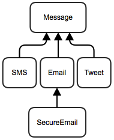

#Messaging (FRQ Polymorphism)

This program deals with a messaging system between people. Each `Person` is defined by the following data:

 - a name
 - email address
 - hand phone number
 - personal encryption key
 - a list of read messages
 - a list of unread messages
 - array of twitter followers

The message objects that are used for communication are organized into the following hierarchy:

A `Message` is defined by the following data:

 - a sender
 - an array of recipients
 - message content
 - date and time of sending

An `SMS` is a message with a limited message content length (160 characters).

A `Tweet` is a message which is sent to all of the sender's followers and has a limited content length (118 characters)

An `Email` is a message with an additional data field for the message subject.

A `SecureEmail` is an email whose content is encrypted using an algorithm based on the senders encryption key.  If the receiver has the same encryption key, they will be able to decrypt the content.

###Part A
Implement the `follows()` method of the `Person` class. This method should return `true` if this `Person` follows the `Person` given as a parameter argument.

###Part B
Override the `Object`'s `toString()` method for the `Message` class. It should return the type of message followed by the sender's name. If the message has been sent it should also state the date and time if sending. Note that the `timeStamp` field of a message will be `null` until it is sent. For example:

>SMS from Wendy
>Tweet from from Sabrina sent 25/02/2014 04:36

###Part C
Override the `toString()` method for the `Email` class. The method should return the subject in double quotations, followed by the sender and the date and time sent (if already sent). For example:

>"Allergy Medication Woes" from Wendy
>"Case Details (private)" from Bob sent 24/09/2013 12:08

###Part D
The `Tweet` class does not work as intended. This class should create a message with a content length of no more than 118 characters. If the given content parameter has a length greater than 118, it should be truncated (the ending cut off). The recipients of a `Tweet` should be all of the followers of the sender. Fix the class definition so it behaves as described.

###Part E
Implement the `send()` method of the `Message` class. This message should assign the current date and time to the `timeStamp` end then sends message to all recipients by adding this message to their `unreadMessages` list.

###Part F
Implement the `readNextMessage` method of the `Person` class. Returns the content of the first message in the `unreadMessage` list. It should remove the message from the `unreadMessage` list and move it to the `readMessage` list. If the message is a `SecureEmail`, call the private helper method `decryptMessage` to decrypt the content using this person's encryption key. Note that this method will be fully implemented in part (h). Right now, you should just call the decryption method.

###Part G
Implement the <tt>getInbox</tt> method of the <tt>Person</tt> class.  This method Returns an array of strings containing the results of calls to the <tt>toString</tt> method of all <tt>unreadMessages</tt> and <tt>readMessages</tt>. If a message is unread it should be preceded by an asterisk (*).

###Part H
Implement the `decryptMessage` method of the `Person` class. This method decodes the content of the Message based on this Person's encryption key. Hint: Analyze the `encryptMessage` method of the `SecureEmail` class and see if the method can be reversed.

